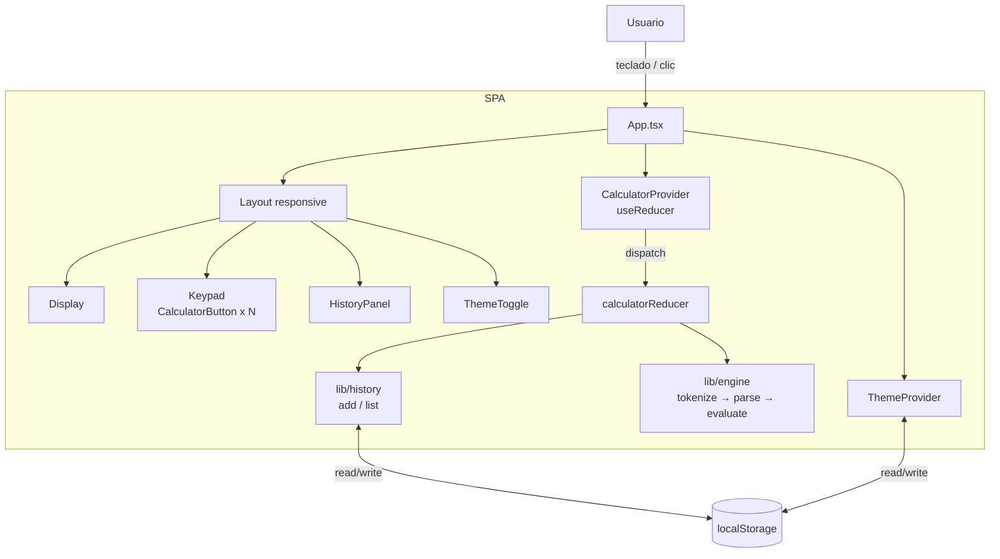

# Arquitectura técnica

<!-- Documento vivo. Actualizar cada vez que cambie el stack, la estructura de carpetas
     o cualquier decisión técnica relevante.
     Los cambios deben registrarse también en changelog/. -->

---

## Stack seleccionado

| Capa | Tecnología | Justificación |
|------|-----------|---------------|
| Framework UI | **React 18** | Stack a aprender. Modelo declarativo encaja bien con calculadora dirigida por estado. |
| Build / dev | **Vite 5** | Servidor de desarrollo instantáneo, build optimizado, sin configuración. |
| Lenguaje | **TypeScript (strict)** | Tipos para `Token`, `CalculatorState`, `HistoryEntry`. Errores en tiempo de compilación. |
| Estilos | **Tailwind CSS** + variables CSS | Utilitarias para velocidad. Los tokens del design system se exponen como variables CSS y se mapean en `tailwind.config`. |
| Estado | `useReducer` + Context API | Suficiente para la complejidad de la app. Cero dependencias extra. |
| Persistencia | `localStorage` (vía hook `useLocalStorage`) | Historial y tema. Sin backend. |
| Iconos | **lucide-react** | Familia única, ligera, tree-shakeable. |
| Tests | **Vitest** + **@testing-library/react** | Vitest es el runner nativo de Vite. React Testing Library para tests de componentes. |
| Lint / format | **ESLint** + **Prettier** | Config estándar Vite + React + TS. |
| Despliegue | **Vercel** | Zero-config para Vite, previews por rama, plan hobby gratis. |
| Repo / CI | GitHub | CI mínima con GitHub Actions: `lint`, `typecheck`, `test`, `build`. |

---

## Diagrama de componentes



---

## Estructura de carpetas

```
.
├── public/                  → Assets estáticos (favicon, manifest si llega)
├── src/
│   ├── main.tsx             → Entry point (monta <App /> en #root)
│   ├── App.tsx              → Composición raíz: providers + layout
│   ├── index.css            → Reset + tokens CSS (:root y [data-theme])
│   │
│   ├── components/
│   │   ├── Display.tsx
│   │   ├── Keypad.tsx
│   │   ├── CalculatorButton.tsx
│   │   ├── HistoryPanel.tsx
│   │   ├── HistoryEntry.tsx
│   │   └── ThemeToggle.tsx
│   │
│   ├── state/
│   │   ├── CalculatorContext.tsx   → Provider + hook useCalculator
│   │   ├── calculatorReducer.ts    → Reducer puro (acciones → estado)
│   │   └── actions.ts              → Tipos de acciones y action creators
│   │
│   ├── lib/
│   │   ├── engine/
│   │   │   ├── tokenize.ts         → string → Token[]
│   │   │   ├── parse.ts            → Token[] → AST (shunting-yard o pratt)
│   │   │   ├── evaluate.ts         → AST → number | CalcError
│   │   │   └── format.ts           → number → string (redondeo, notación)
│   │   ├── history.ts              → CRUD del historial sobre localStorage
│   │   └── keyboard.ts             → Mapeo de KeyboardEvent → acción
│   │
│   ├── hooks/
│   │   ├── useLocalStorage.ts      → Hook genérico tipado
│   │   ├── useTheme.ts             → Lectura/escritura del tema
│   │   └── useKeyboard.ts          → Listener global de teclas
│   │
│   ├── types/
│   │   └── calculator.ts           → Token, CalculatorState, HistoryEntry, CalcError
│   │
│   └── test/
│       ├── engine.test.ts          → Tests del motor (núcleo crítico)
│       ├── reducer.test.ts         → Tests del reducer
│       └── components/             → Tests de componentes clave
│
├── index.html               → HTML raíz (lang="es")
├── tailwind.config.ts       → Tokens de color/espaciado mapeados a variables CSS
├── vite.config.ts
├── tsconfig.json            → strict: true
├── .eslintrc.cjs
├── .prettierrc
└── package.json
```

---

## Modelo de estado (resumen, detalle en data-model.md)

El estado de la calculadora vive en un único reducer:

```ts
type CalculatorState = {
  expression: string;        // Lo que el usuario está construyendo
  result: string | null;     // Último resultado (display secundario)
  error: string | null;      // Mensaje de error, si existe
  history: HistoryEntry[];   // Persistido en localStorage
};
```

Acciones principales (lista no exhaustiva):

- `INPUT_DIGIT` (`'0'..'9'`, `.`)
- `INPUT_OPERATOR` (`+`, `−`, `×`, `÷`, `^`)
- `INPUT_FUNCTION` (`log`, `ln`, `sin`, `cos`, `tan`, `√`, `n!`)
- `INPUT_CONSTANT` (`π`, `e`)
- `INPUT_PAREN` (`(`, `)`)
- `BACKSPACE`
- `CLEAR_ENTRY` (`C`)
- `CLEAR_ALL` (`AC`)
- `EVALUATE` (`=`)
- `RECALL_FROM_HISTORY` (COULD)

El reducer es **puro**: dado `(state, action)` devuelve el siguiente estado. La
evaluación matemática y la escritura en `localStorage` se hacen vía funciones
helpers invocadas desde el reducer, no como side effects asíncronos.

---

## Motor de cálculo (`lib/engine`)

Pipeline por evaluación:

1. **Tokenize:** la cadena `"log(100)+3^2"` se parte en tokens
   (`FUNC(log)`, `LPAREN`, `NUMBER(100)`, `RPAREN`, `OP(+)`,
   `NUMBER(3)`, `OP(^)`, `NUMBER(2)`).
2. **Parse:** se construye un AST respetando precedencia con **shunting-yard**
   (alternativa: Pratt parsing). Precedencia: `^` > unario > `×`/`÷` > `+`/`−`.
3. **Evaluate:** recorrido recursivo del AST.
   - Trigonometría siempre en **grados**: `sin(x)` se evalúa como
     `Math.sin(x * π / 180)`. Mismo patrón para `cos` y `tan`.
   - `log` = base 10 (`Math.log10`), `ln` = natural (`Math.log`).
   - Factorial: solo enteros ≥ 0; lanza `CalcError('Factorial solo para enteros ≥ 0')`.
4. **Format:** número → string mostrado. Reglas:
   - Si `|x| ≥ 1e16` o `0 < |x| < 1e-9`: notación científica.
   - Si entero: sin decimales.
   - Si decimal: hasta 12 dígitos significativos, sin ceros finales.

Los errores se modelan como excepciones tipadas (`CalcError`) que el reducer
captura y traduce a `state.error`.

---

## Persistencia

Una única clave por dato en `localStorage`:

| Clave | Tipo | Descripción |
|-------|------|-------------|
| `calc.theme` | `'light' \| 'dark'` | Tema elegido por el usuario. |
| `calc.history.v1` | `HistoryEntry[]` (JSON) | Últimas N operaciones. |

**Límite del historial:** N = 100 entradas. Al añadir la 101ª, se descarta la
más antigua (FIFO).

**Versionado:** la clave incluye `v1`. Si en el futuro cambia el formato, se
usa una nueva clave (`v2`) y se migra/descarta `v1`.

Toda la lectura/escritura pasa por `lib/history.ts` y el hook
`useLocalStorage` (try/catch + fallback en memoria si `localStorage` no está
disponible — modo incógnito de algunos navegadores).

---

## Estrategia de autenticación

**No aplica.** El producto no tiene cuentas de usuario ni backend. Cada
navegador es un silo aislado.

---

## Integraciones externas

**Ninguna en runtime.** No hay APIs de terceros, ni analítica, ni
telemetría. Las fuentes (Inter, JetBrains Mono) se cargan desde
**fontsource** como dependencias npm para no depender de Google Fonts en
runtime — todo queda autocontenido en el bundle.

---

## Estrategia de despliegue

- **Repo:** GitHub, rama principal `main`.
- **Ramas de feature:** `feature/...` que se mergean a `main` vía PR.
- **Vercel:**
  - `main` → producción (URL fija).
  - Cada PR → preview deploy.
- **Variables de entorno:** ninguna en v1.
- **Build:** `vite build` produce `dist/` estático. Vercel lo sirve tal cual.

### CI (GitHub Actions)

Workflow `ci.yml` que corre en cada push / PR:

1. `npm ci`
2. `npm run lint`
3. `npm run typecheck` (`tsc --noEmit`)
4. `npm run test` (Vitest en modo CI)
5. `npm run build`

Solo se hace deploy desde Vercel si la CI pasa (Vercel respeta el estado de
GitHub checks).

---

## Decisiones técnicas relevantes

### 2026-05-11 — useReducer + Context en lugar de Zustand

**Contexto:** la calculadora tiene estado complejo (expresión, resultado,
error, historial) pero acotado y centralizado.

**Opciones consideradas:**
- `useState` local + prop drilling.
- `useReducer` + Context API.
- Zustand.

**Decisión:** `useReducer` + Context.

**Consecuencias:** una sola dependencia menos, transiciones de estado
explícitas y testeables (el reducer es una función pura), encaja con el
objetivo de aprender React idiomático. Si la app crece más allá del scope
previsto, migrar a Zustand es trivial.

### 2026-05-11 — Motor de cálculo propio, no `eval` ni `mathjs`

**Contexto:** hay que evaluar expresiones como `log(100)+sin(30)*2`.

**Opciones consideradas:**
- `eval` / `new Function` (rápido pero inseguro y no soporta funciones
  matemáticas custom).
- `mathjs` (potente pero +600 kB al bundle).
- Motor propio (tokenize + shunting-yard + evaluate).

**Decisión:** motor propio.

**Consecuencias:** bundle pequeño, control total sobre formato y errores,
y — sobre todo — vale como ejercicio de aprendizaje (uno de los objetivos del
proyecto). Coste: implementar tokenizador, parser y evaluador con tests.

### 2026-05-11 — Tailwind sobre los tokens del design system

**Contexto:** el design system define tokens (`--bg`, `--fg`, `--accent`…)
con valor distinto en claro/oscuro.

**Opciones consideradas:** CSS Modules, CSS plano global, Tailwind.

**Decisión:** Tailwind, con los tokens del design system mapeados en
`tailwind.config.ts` (`colors.bg = "var(--bg)"`, etc.).

**Consecuencias:** clases utilitarias como `bg-bg text-fg` aplican el tema
automáticamente sin duplicar valores. Hay que mantener `tailwind.config.ts`
sincronizado con `docs/design-system.md` — esto es responsabilidad del
protocolo de cambios.

---

## Cosas que NO hacemos (técnicas)

- **No `eval`** ni `new Function` para evaluar expresiones.
- **No CSS-in-JS** (styled-components, emotion): añade peso y complejidad
  innecesarios.
- **No state management global pesado** (Redux, MobX).
- **No `any`** en TypeScript salvo justificación explícita.
- **No tests E2E** (Playwright/Cypress) en v1. Vitest cubre lo necesario.
- **No PWA / service worker** en v1.
