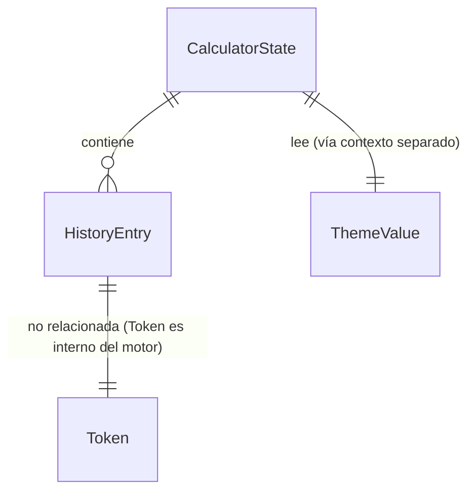

# Modelo de datos

<!-- Actualizar este archivo cada vez que se añada, modifique o elimine una entidad.
     En este proyecto no hay base de datos: el modelo de datos vive en TypeScript
     y se persiste en localStorage. -->

---

## Contexto

Este proyecto **no tiene base de datos**. El modelo de datos se describe como
**tipos de TypeScript** y se persiste en el `localStorage` del navegador.

Toda la persistencia pasa por una capa única (`src/lib/history.ts` y el hook
`useLocalStorage`) que se encarga de serializar/deserializar JSON y de
versionar las claves.

---

## Entidades principales

### Token

Unidad léxica producida por `tokenize.ts`. No se persiste; vive solo dentro
del motor de cálculo.

```ts
type TokenType =
  | 'NUMBER'    // 3, 3.14, 1e-5
  | 'OP'        // +, -, *, /, ^
  | 'FUNC'      // log, ln, sin, cos, tan, sqrt
  | 'CONST'     // PI, E
  | 'FACT'      // !
  | 'LPAREN'    // (
  | 'RPAREN';   // )

type Token =
  | { type: 'NUMBER'; value: number }
  | { type: 'OP'; op: '+' | '-' | '*' | '/' | '^' }
  | { type: 'FUNC'; name: 'log' | 'ln' | 'sin' | 'cos' | 'tan' | 'sqrt' }
  | { type: 'CONST'; name: 'PI' | 'E' }
  | { type: 'FACT' }
  | { type: 'LPAREN' }
  | { type: 'RPAREN' };
```

### CalculatorState

Estado completo de la calculadora, gobernado por `calculatorReducer`.

```ts
type CalculatorState = {
  expression: string;        // Expresión en construcción (ej. "log(100)+3")
  result: string | null;     // Último resultado formateado, o null si aún no se evaluó
  error: string | null;      // Mensaje de error vigente, o null
  angleMode: 'DEG';          // Fijo en v1; preparado para 'DEG' | 'RAD' en el futuro
  history: HistoryEntry[];   // Espejo del historial persistido
};
```

**Invariantes:**

- Si `error !== null`, la próxima acción que no sea `CLEAR_*` debe limpiar el
  error antes de procesarse.
- `result` solo se rellena al ejecutar `EVALUATE` con éxito.
- `history` se mantiene sincronizado con `localStorage` en cada `EVALUATE`
  exitoso.

### HistoryEntry

Una operación registrada en el historial. **Sí se persiste.**

```ts
type HistoryEntry = {
  id: string;          // crypto.randomUUID(); identificador estable
  expression: string;  // Expresión tal y como la introdujo el usuario
  result: string;      // Resultado formateado para mostrar
  timestamp: number;   // Date.now() en el momento de la evaluación
};
```

**Reglas:**

- Solo se añaden entradas tras una evaluación **sin error**.
- Las entradas son **inmutables**: no se editan; en v1 tampoco se borran
  individualmente (eso es COULD en el PRD).
- Orden de visualización: más reciente primero (`timestamp` descendente).

### ThemeValue

```ts
type ThemeValue = 'light' | 'dark';
```

Se persiste por separado bajo `calc.theme`.

### CalcError

Errores tipados que devuelve el motor de cálculo y captura el reducer.

```ts
type CalcErrorCode =
  | 'DIVISION_BY_ZERO'
  | 'NEGATIVE_SQRT'
  | 'LOG_NON_POSITIVE'
  | 'FACTORIAL_INVALID'    // factorial de no entero o negativo
  | 'SYNTAX'               // expresión mal formada
  | 'OVERFLOW';            // resultado no finito (Infinity, NaN)

class CalcError extends Error {
  code: CalcErrorCode;
}
```

Mapeo a microcopy (debe coincidir con `docs/design-system.md`):

| Código | Mensaje en español |
|--------|--------------------|
| `DIVISION_BY_ZERO` | "División por cero" |
| `NEGATIVE_SQRT` | "Raíz de número negativo" |
| `LOG_NON_POSITIVE` | "Logaritmo de cero o negativo" |
| `FACTORIAL_INVALID` | "Factorial solo para enteros ≥ 0" |
| `SYNTAX` | "Expresión incompleta" |
| `OVERFLOW` | "Resultado fuera de rango" |

---

## Relaciones entre entidades



`Token` no es una entidad de dominio: vive solo durante una evaluación y se
descarta inmediatamente. Por eso no participa de relaciones reales.

---

## Persistencia (localStorage)

Una entrada por dato, con la clave **prefijada y versionada**:

| Clave | Tipo serializado | Tamaño máximo | Descripción |
|-------|------------------|---------------|-------------|
| `calc.theme` | `"light"` \| `"dark"` (string crudo, sin JSON) | ~5 bytes | Tema elegido por el usuario. |
| `calc.history.v1` | `HistoryEntry[]` en JSON | ~100 entradas × ~150 B ≈ 15 KB | Historial de operaciones. |

**Estructura JSON de `calc.history.v1`:**

```json
[
  {
    "id": "9f3a…",
    "expression": "log(100)+3",
    "result": "5",
    "timestamp": 1747000000000
  }
]
```

### Reglas de escritura

- Toda escritura pasa por `lib/history.ts` o `hooks/useLocalStorage.ts`.
- Se serializa con `JSON.stringify` y se deserializa con `JSON.parse` envuelto
  en `try/catch`.
- Si el parseo falla (datos corruptos), se descarta la clave y se arranca con
  estado vacío. No se intenta recuperar a medias.
- Si `localStorage` no está disponible (modo incógnito de algunos navegadores
  o cuota llena), la app cae a un **fallback en memoria** que se pierde al
  recargar. La app no debe romperse.

### Límites

- **Historial:** máximo **100 entradas**. Al añadir la 101ª, se descarta la
  más antigua (FIFO sobre `timestamp`).
- **Tema:** valor único, sin lista ni acumulación.

### Versionado de claves

La clave del historial incluye `v1`. Si el formato cambia de forma
incompatible:

1. Se crea `calc.history.v2`.
2. Si existe `calc.history.v1`, se intenta migrar (script ad-hoc en
   `lib/history.ts`) o se descarta con un aviso al usuario.
3. La migración se registra en el changelog y en este documento.

---

## Políticas de acceso

**No aplica.** No hay backend, no hay autenticación, no hay roles.

Cada navegador es un silo aislado: los datos solo son accesibles desde el
mismo origen (`https://<dominio>`) y solo para el usuario que controla ese
navegador. No hay forma de compartir historial entre dispositivos.

---

## Migraciones

Las "migraciones" en este proyecto son cambios incompatibles del schema de
`localStorage`. Se versionan cambiando el sufijo de la clave (`v1` → `v2`) y
se documentan aquí.

| Fecha | Versión | Cambio |
|-------|---------|--------|
| 2026-05-11 | `v1` (inicial) | Esquema inicial de `HistoryEntry` documentado arriba. |

---

## Datos seed

No hay datos iniciales. La app arranca con:

- `history` vacío.
- `theme` igual a `prefers-color-scheme` del sistema (con default `dark` si
  no hay preferencia detectable).
